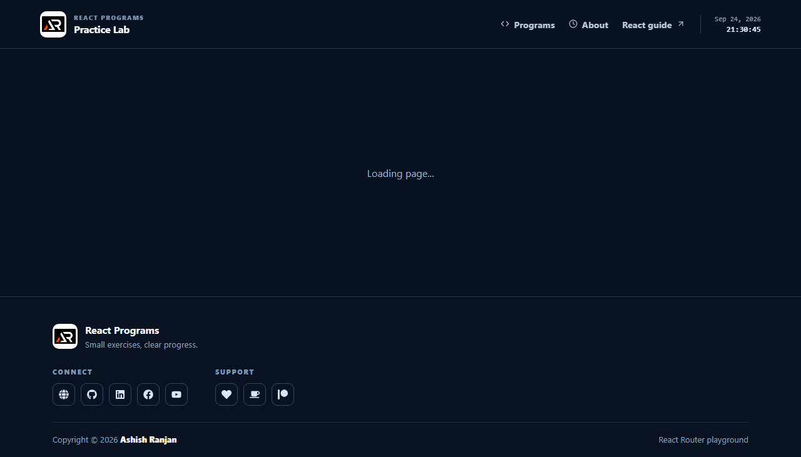

# React Programs

A focused React practice playground for learning components, JSX, routing, and reusable UI patterns through small exercises.



## Features

- Fixed responsive header with live date and time.
- Practice cards for core React ideas.
- React Router routes with lazy loading and a not-found page.
- Local branding assets and icon-only social and support links.
- GitHub Pages deployment setup.

## Tech stack

React, Vite, React Router, styled-components, CSS, and React Icons.

## Run locally

```bash
npm install
npm run dev
```

Build with `npm run build` and deploy with `npm run deploy`.

## Live

[Open the live project](https://a2rp.github.io/reactjs_programs/)

## Links

- Portfolio: [https://www.ashishranjan.net](https://www.ashishranjan.net)
- GitHub: [https://github.com/a2rp](https://github.com/a2rp)
- CodePen: [https://codepen.io/ash1198](https://codepen.io/ash1198)
- LinkedIn: [https://www.linkedin.com/in/aashishranjan](https://www.linkedin.com/in/aashishranjan)
- Facebook: [https://www.facebook.com/theash.ashish/](https://www.facebook.com/theash.ashish/)
- YouTube: [https://www.youtube.com/@ashishranjan-ashz?sub_confirmation=1](https://www.youtube.com/@ashishranjan-ashz?sub_confirmation=1)
- Email: [ash.ranjan09@gmail.com](mailto:ash.ranjan09@gmail.com)

## Support

- Support: [https://a2rp-donation-page.netlify.app/](https://a2rp-donation-page.netlify.app/)
- Buy Me a Coffee: [https://buymeacoffee.com/a2rp](https://buymeacoffee.com/a2rp)
- Patreon: [https://patreon.com/a2rp](https://patreon.com/a2rp)
